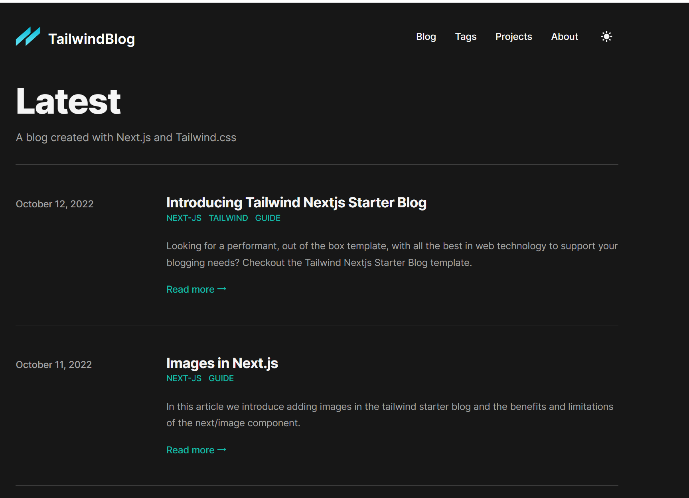

<h1 align="center">layfor 的个人博客和主页</h1> 
<p align="center"><b>一点一滴积累的前端作品</b></p>

<p align="center">

  <a href="https://github.com/misitebao/yakia/blob/main/LICENSE">
    
  </a>
  <a href="https://github.com/misitebao/yakia/blob/main/LICENSE">
    
  </a>
  
  
  
  
  
  
  
  <br/>

</p>

<div align="center">
<strong>
<samp>

[English](README_en.md) · 简体中文

</samp>
</strong>
</div>

## 快速开始

### 安装

```bash
# 克隆项目
git clone `repoUrl`

# 安装依赖
npm install

# 启动服务
npm run dev

# 打包构建
npm run build
```

### 作品展示


[→ 查看 demo , 后续添加 vercel 部署后的域名](www.google.com)

## 贡献者

<table>
    <tbody>
        <tr>
            <td>
                <a target="_blank" href="https://github.com/lalalavard"></a>
            </td>
            <td>
                <a target="_blank" href="https://github.com/layfor"></a>
            </td>
        </tr>
    </tbody>
</table>

## 维护者

- [lavard](https://github.com/lalalavard)
- [layfor](https://github.com/laylayfor)

## 鸣谢

- [people](www.google.com)

## 协议

[MIT](./LICENSE) © [layfor](https://www.layfor.cn)
